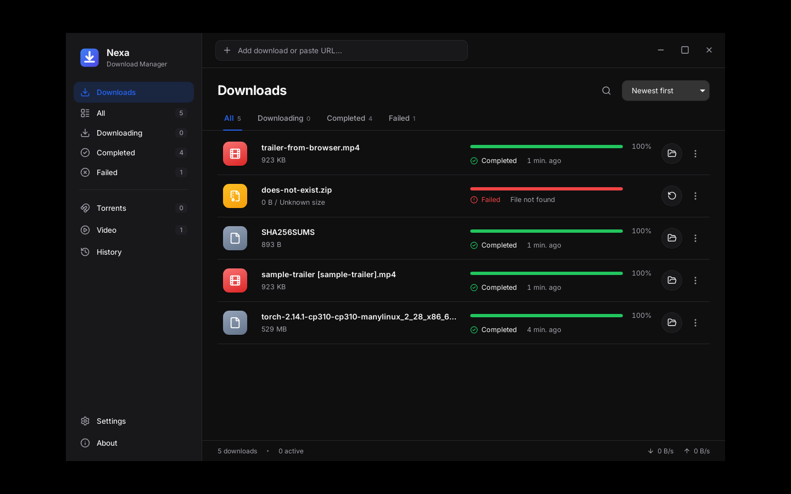

# Nexa Download Manager

**Simple. Fast. Powerful.** A minimal desktop download manager for Windows built with
Tauri 2, Rust and React.

- **HTTP/HTTPS** downloads with resume (Range + If-Range validation), up to 16
  parallel connections per file, crash-safe segment state, disk-space checks
- **Torrents and magnet links** (librqbit): metadata, file selection, real peer
  and speed statistics, pause/resume
- **Video/site downloads** through **yt-dlp**: metadata, thumbnail, quality presets,
  audio-only, real progress
- **Queue**: simultaneous-download limit, priorities, reordering, per-download
  and global speed limits, retries with backoff, time-window scheduler
- **Browser integration** through Native Messaging (Chrome, Edge, Brave, Chromium,
  Vivaldi, Firefox) with a reference extension in [`browser-extension/`](browser-extension/)
- **Persistence and recovery**: SQLite with migrations; interrupted downloads
  resume from the bytes already on disk after a restart or crash
- System tray, notifications, optional clipboard detection, history, search,
  filters, categories, light/dark themes, English and Persian (RTL)



No analytics, no accounts, no cloud: nothing leaves your machine except the
downloads you start.

> Only download content you are authorized to download. Site extractors change
> over time; yt-dlp can be updated independently from the app (Settings → Engines).

## Quick start (development)

Prerequisites are listed in [BUILD.md](BUILD.md) (Node 22+, Rust stable, and on
Windows the MSVC build tools; WebView2 ships with Windows 10/11).

```bash
npm install
npm run dev          # builds the native host sidecar, then starts the app with hot reload
```

## Tests

```bash
npm run typecheck                    # TypeScript
npm test                             # frontend tests (Vitest)
node --test browser-extension/test/  # browser extension tests
node scripts/build-native-host.mjs --debug   # once: the sidecar is needed to compile the app
cargo test --workspace               # Rust unit + integration tests
cargo clippy --workspace --all-targets -- -D warnings
```

The Rust integration tests run real downloads against local servers: HTTP
(ranges, slow streams, failures, crash recovery), a local BitTorrent seeder with a
tracker, yt-dlp against an FFmpeg-generated clip (skipped if yt-dlp/FFmpeg are not
installed), and the native messaging host end-to-end.

## Production build and Windows installer

```bash
npm run build            # native host (release) + `tauri build` for the current platform
npm run package:windows  # Windows: bundles checksum-verified yt-dlp, builds the NSIS installer
```

The installer is written to `target/release/bundle/nsis/Nexa Download Manager_<version>_x64-setup.exe`.
It installs per user, creates Start menu shortcuts, registers the native messaging
host for all supported browsers, associates `.torrent` files and removes the
browser integration on uninstall (your downloads and settings are kept).

## Documentation

- [BUILD.md](BUILD.md) — prerequisites, building, packaging, signing, CI
- [ARCHITECTURE.md](ARCHITECTURE.md) — how the pieces fit together
- [TROUBLESHOOTING.md](TROUBLESHOOTING.md) — common problems and where the logs are
- [docs/BROWSER_PROTOCOL.md](docs/BROWSER_PROTOCOL.md) — the versioned extension protocol
- [docs/QA_CHECKLIST.md](docs/QA_CHECKLIST.md) — manual release checklist
- [browser-extension/README.md](browser-extension/README.md) — installing the reference extension

## Repository layout

```
crates/nexa-core/        Rust core: engines, queue manager, SQLite, settings, protocol, bridge
  migrations/            SQL migrations
  tests/                 integration tests (HTTP, torrent, video)
crates/nexa-native-host/ native messaging host binary (+ end-to-end tests)
src-tauri/               Tauri shell: IPC commands, tray, notifications, logging, config
src/                     React + TypeScript UI (components, pages, stores, i18n, services)
browser-extension/       reference MV3 extension (Chromium + Firefox)
installer/               NSIS hooks (native host registration)
scripts/                 build helpers (sidecar, engine bundling, license notices)
third_party/             patched third-party crate (see its README)
docs/                    protocol spec and QA checklist
```

## License

MIT — see [LICENSE](LICENSE). Third-party components are listed in
[`src-tauri/resources/THIRD-PARTY-NOTICES.md`](src-tauri/resources/THIRD-PARTY-NOTICES.md)
(also shown in the app under About → Open source licenses).
